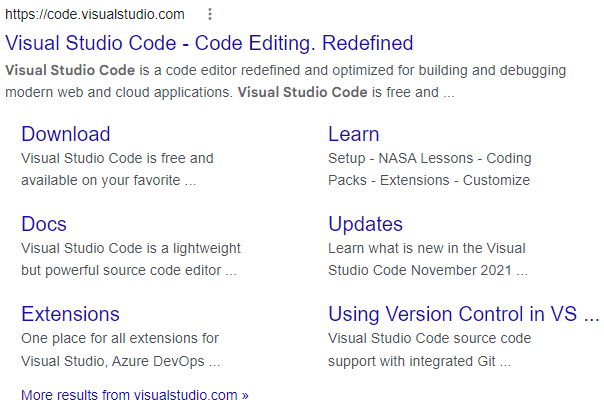
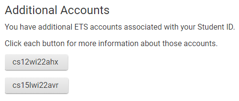
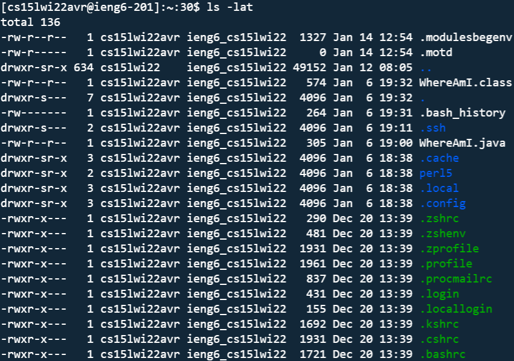
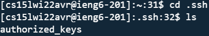
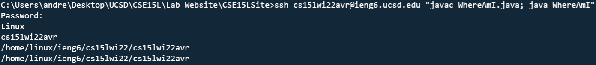

# Lab Report 1
## Remote Access and the Filesystem

1. ### Installing VS Code
    - Type visual studio code into google and downlad it
    
    - Follow the installation instructions
2. ### Remotely Connecting
    - Install OpenSSH if using windows in order to make SSH keys
    - Get your lab computer id [here](https://sdacs.ucsd.edu/~icc/index.php)
    - You should see your accounts like this:
    
    - Type the following with your id replacing the zz: ssh cs15lwi22zz@ieng6.ucsd.edu
3. ### Trying Some Commands
    - cd followed a directory will change the current directory of the terminal to the target directory
    - ls followed by a directory will show the files in that directory
    - ls -a will show all files and ls -lat will show extra facts about each file and organize them by time saved
    
4. ### Moving files with scp
    - The following command will move file.txt to the zz lab computer: scp whereAmI.java cs15lwi22zz@ieng6.ucsd.edu:~/
    - You may need to enter your password
    - You should then be able to ls and see it like so:
    
5. ### Setting an SSH Key
    - You should be able to create an SSH key using the command ssh-keygen
    - Then use scp to move the public SSH key to the server scp /path/to/id_rsa.pub cs15lwi22@ieng6.ucsd.edu:~/.ssh/authorized_keys
    - This process may not work if you already have previous SSH keys setup in your systems default location
    - The following commands can be used to make sure you were able to copy over the public key:
    
6. ### Optimizing Remote Running
    - You can run multiple commands at once by separating them by semicolons I.E. javac test.java; java test
    - You can also perform single-run commands over SSH by typing ssh cs15lwi22zz@ieng6.ucsd.edu "command here"
    - Combined you can do things like this:
    

