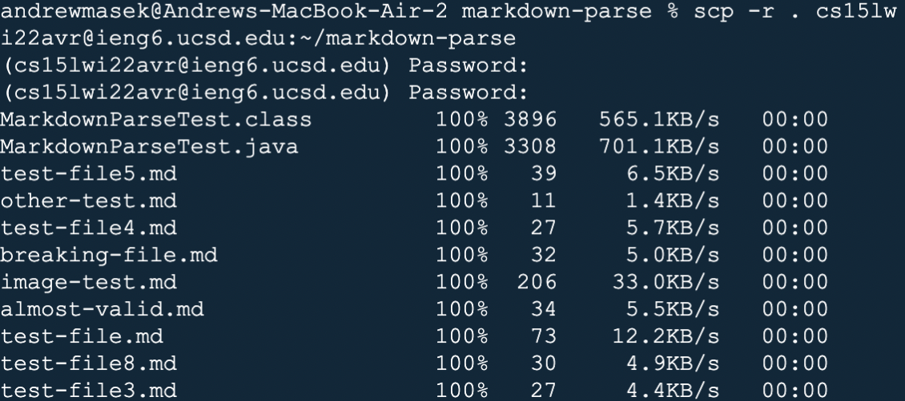
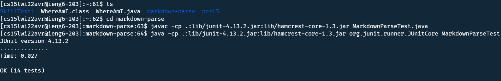
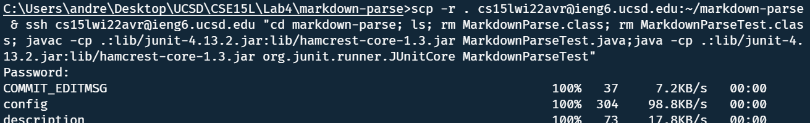

# Lab Report 3
##  Copying whole directories with scp -r

1. ### Copying Markdown-Parse to ieng6
    
    I just use scp -r to copy mark-downparse to ieng6

2. ### Running the code through SSH
    
    After using scp to move the files I can cd into the markdown-parse directory and run the tester normally.
3. ### Copying and running the code
    
    The following command copies the markdown-parse folder, removes old compilations, and then runs the tests.
    ```
    scp -r . cs15lwi22avr@ieng6.ucsd.edu & ssh cs15lwi22avr@ieng6.ucsd.edu "cd markdown-parse; ls; rm MarkdownParse.class; rm MarkdownParseTest.class; javac -cp .:lib/junit-4.13.2.jar:lib/hamcrest-core-1.3.jar MarkdownParseTest.java;java -cp .:lib/junit-4.13.2.jar:lib/hamcrest-core-1.3.jar org.junit.runner.JUnitCore MarkdownParseTest"
    ```