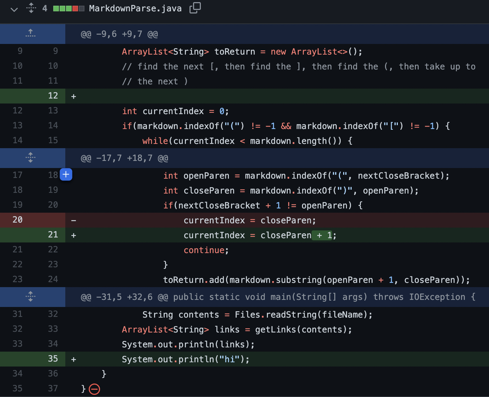

# Lab Report 3
##  Copying whole directories with scp -r

1. ### Bug Fix #1
    
    [Problematic test file here](markdowntestfiles/test-file2.md)
    
    When run on test-file2.md, the program gets stuck trying to parse the next link, when only normal text remains.The resultof this is that it adds empty strings to the arraylist without actually progressing until the program runs out of memory causing the symptom of a OutOfMemoryError.

2. ### Bug Fix #2
    
    [Problematic test file here](markdowntestfiles/almost-valid.md)
    
    When run on almost-valid.md, the program is unable to continue forward so it has an infinite loop. Unlike with the previous bug, no additions are made to the arraylist so the program doesn't run out of memory. Since there's an infinite loop, there is the symptom of nothing being printed.
3. ### Bug Fix #3
    
    [Problematic test file here](markdowntestfiles/other-test.md)
    
    When run on other-test.md, the program is unable to continue forward so it has an infinite loop. It continues trying to find a link when there is none because there are brackets in the file. The infinite loop results in the symptom of nothing being printed.