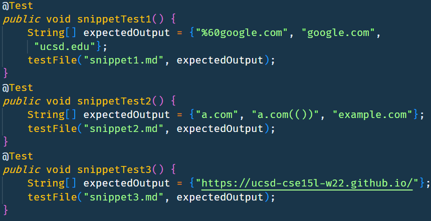
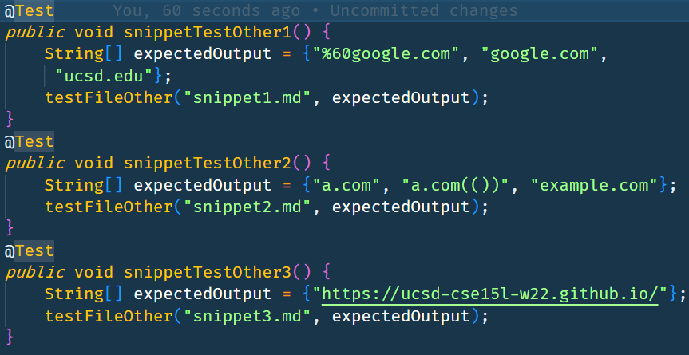

# Lab Report 4
##  Making changes to Markdown Parse

### MarkdownParse implementations tested:
    Mine: https://github.com/portoaj/markdown-parse
    Other: https://github.com/tanpatil/markdown-parse

### Adding testing code to MarkdownParseTest.java
I used a modified version of my testFile helper method that called on the other Repo's MarkdownParse instead of my MarkdownParse
Mine: 

Other:

### Testing each snippet
1. The first snippet should produce the following links:
%60google.com, google.com, and ucsd.edu
Both implementations failed for this test.
My implementation failed with the message:
Expected [%60google.com] but was [url.com]
The other implementation failed with the message:
java.lang.AssertionError: Link size was 2 expected size was 3 

2. The second snippet should produce the following links:
a.com, a.com(()), and example.com
Both implementations failed for this test.
My implementation failed with the message:
java.lang.AssertionError: Link size was 2 expected size was 3
The other implementation failed with the message:
java.lang.AssertionError: Link size was 1 expected size was 3

3. The third snippet should produce the following link: https://ucsd-cse15l-w22.github.io/
Both implementations failed for this test.
My implementation failed with the message:
Expected [https://www.twitter.com] but was [    https://www.twitter.com]
The other implementation failed with the message:
java.lang.AssertionError: Link size was 0 expected size was 1

### Possible code changes
1. I think I could make a code change in less than 10 lines of code to prevent this issue. One solution would be to check for backticks between openbracket and closeparen.
2. I think I would need more than 10 lines of code to prevent this issue. I would need to create a stack and push each forward bracket or parentheses and make sure that as I hit each back bracket or parentheses it matches the popped value to find the outermost bracket or parentheses.
3. I think I could solve this issue in less than 10 lines of code. I could trim my results to not include spaces at the beginning or end of my result strings.