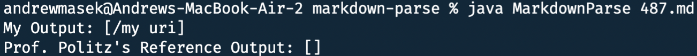
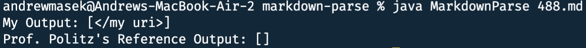

# Lab Report 5
## How I Found Issues
I stuck to the simple strategy of manually running both Markdown Parse implementations on each file because I assumed they were both broken enough that it wouldn't take that long to find two issues.
## Test Case #1
The problematic test case is Common Mark test #487:
[link](/my uri)\n
Here are the results for both my and Prof. Politz's MarkdownParse implementations:

Prof Politz's implementation correctly didn't find any link whereas mine incorrectly did. The reason that mine incorrectly thought that there was a link was because it didn't pick up on the fact that there was a space in the middle of what should be the link url, making the url invalid. To fix this I could just loop through each character between the parentheses (after trimming it) and make sure that there isn't a space.
## Test Case #2
The problematic test case is Common Mark test #488:
[link](</my uri>)\n
Here are the results for both my and Prof. Politz's MarkdownParse implementations:

In this case my implementation got the correct answer out of sheer luck as it didn't recognize that the spaces in the middle of the link would make it invalid as described above. However, the < and > characters create an Automatic Link based on whatever is inside and it seems that links created with those can have spaces inside oddly. The reference implentation could be updated to look for a combination of < and > and then skip checking for spaces within those because whatever is in there will become an automatic link.